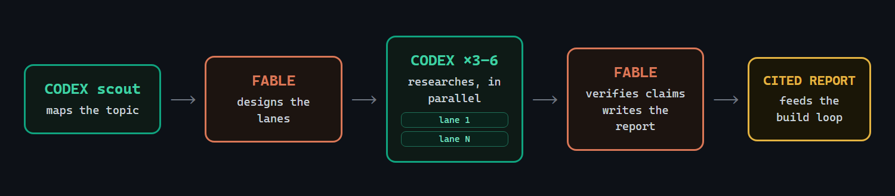

# architect-loop

**Opus 4.8 handles planning and review; minimax-m3 (via the `pi` CLI) handles
implementation and research.** Two Claude Code skills wire that split into a
repo-centered loop: specs and gates are written first, the builder works in fresh
contexts, and the architect reviews the evidence before anything is integrated.

## Install (30 seconds)

```bash
git clone https://github.com/jetpks/architect-loop-multi-provider
cd architect-loop-multi-provider/opus-48-minimax-m3 && ./install.sh   # Windows: .\install.ps1
pi install npm:pi-web-access             # web access for builders/researchers
```

`./install.sh --project` installs to the current repo only instead of
globally, and also installs the `pi-sandbox` builder-confinement helper. You
need [Claude Code](https://claude.com/claude-code) on any paid plan for the
architect, and the [`pi`](https://pi.dev) CLI with an `OPENROUTER_API_KEY` for
the builder (it runs `minimax/minimax-m3` on OpenRouter, billed per token). The
builder sandbox uses Apple Seatbelt on macOS (built in) and
[Landlock](https://github.com/Zouuup/landrun) on Linux (`landrun`, kernel
5.13+); without a policy sandbox the loop falls back to a single combined lane.

## Use (two commands)

```
/architect                                      # the build loop
/architect-research <what you're considering>   # the research loop
```

`/architect` runs one work block: judge the last run, spec the next slice,
dispatch builders. `/architect-research` is for when you're still deciding
*what* to build — its cited report feeds the build loop's PRD.

## /architect


One short architect session per work block — judgment only, it never writes code:

- **Spec + gates first.** The architect specs a one-PR slice, splits it into
  1–4 lanes whose file sets are checked for overlap, and commits the acceptance
  gates to `docs/gates/` *before* any builder starts. Gates are read-only; a
  builder edit to a gate file fails the slice automatically.
- **Parallel sandbox-isolated builders.** One fresh `pi -p` (xhigh thinking)
  per lane, each in its own git worktree, launched in the background (staggered,
  since minimax-m3 drops concurrent OpenRouter requests). `pi` has no built-in
  sandbox and its bash tool won't hold a worktree cwd, so each launch is wrapped
  in `pi-sandbox` (Apple Seatbelt / Linux Landlock) confining writes to that
  worktree — a stray `cd` into the main checkout can read but not write, and
  `git` commits fail with `EPERM`, so isolation and the no-commit rule are
  runtime-enforced (the post-flight `git log` check is now just defense-in-depth).
  Builders must argue with the spec before building (silent compliance = defect),
  build only their declared files, and report raw results. (No policy sandbox —
  Windows / old kernel — falls back to one combined lane in the main checkout.)
- **The architect judges and integrates.** It runs the gate commands itself
  (builder claims are hearsay), reads the diff against the spec's intent (passing
  tests ≠ mergeable work), then commits and merges passing lanes. Judgment
  happens in a fresh session because the cited evidence favors fresh-context
  review.
- **The repo is the only memory.** `docs/HANDOFF.md` (a short table of
  contents, pruned every session), `docs/gates/`, `docs/lanes/`, git
  history. Not in the repo = didn't happen.
- **Supervision built in.** Liveness checks on dispatched runs, stall triage
  (diagnose the child process tree, kill the narrowest thing), explicit
  timeouts on every long command.

## /architect-research



Scout-first, like the production deep-research systems — no fixed lane
taxonomy:

- **A cheap `pi` scout maps the topic** (~10 searches): canonical
  terminology, the load-bearing systems and papers, the named people, the
  topic's natural fault lines. Skipped for comparisons and fact-finds.
- **The architect designs 3–6 topic-specific lanes** from the scout's map,
  drawing per-source-class tactics from a library (academic citation
  snowballing, dependents-not-stars repo evidence, emerging-vs-hype gating,
  production pattern mining, expert tracking) — checked for overlap and gaps
  before dispatch.
- **Parallel `pi` researchers** run under hard budgets: search caps, ≤5
  subjects per lane, saturation stop, strict findings discipline (URL + date
  + quote + confidence tag; NOT FOUND beats inference; no recommendations).
  Expert opinion runs as a second wave, roster-seeded by the first.
- **The architect verifies and writes.** ≥2 independent sources per
  load-bearing claim, adversarial falsification searches, citations only from
  URLs actually fetched — then one author writes one decision-oriented report.
  Gathering parallelizes; synthesis never does.

## Why this shape

Each design choice is source-backed (full citations in
[DESIGN.md](DESIGN.md)):

- Weak planners hurt more than weak executors — so the architect model does
  the design, and builders get explicit specs.
- Manager + worktree-isolated workers is a well-supported topology for
  shared-artifact software work. `pi` lacks the sandbox that normally enforces
  that isolation, so this variant wraps each builder in an OS policy sandbox
  (Seatbelt/Landlock) that confines writes to its worktree and blocks commits —
  restoring the guarantee at the runtime layer (see DESIGN.md R8).
- Frozen external gates beat trusting the agent — but agents game visible
  tests and their passing PRs are frequently unmergeable, so the architect
  also reads the diff.
- Memory files rot — so the handoff stays a short map, and detail lives in
  linked gate/lane files.
- The surveyed production deep-research systems use planner-designed
  decomposition rather than fixed lanes — so research lanes are designed per
  topic, after a scout pass.

## What's in the box

| File | What it is |
|---|---|
| [DESIGN.md](DESIGN.md) | The design document — 12 enforced rules, failure-mode table, cited sources |
| [skills/architect/SKILL.md](skills/architect/SKILL.md) | The architect role: hard rules + procedure |
| [skills/architect/dispatch.md](skills/architect/dispatch.md) | Verified `pi` commands, builder block, sandboxed worktree fan-out, truncation rescue, stall triage |
| [skills/architect/sandbox/pi-sandbox](skills/architect/sandbox/pi-sandbox) | Builder confinement: Seatbelt (macOS) / Landlock (Linux) write-jail around `pi` |
| [skills/architect/research.md](skills/architect/research.md) | Slice-scale inline fact-check fan-out |
| [skills/architect/HANDOFF.template.md](skills/architect/HANDOFF.template.md) | The repo-memory file |
| [skills/architect-research/SKILL.md](skills/architect-research/SKILL.md) | Research orchestration: scout → design → fan out → verify → write |
| [skills/architect-research/lanes.md](skills/architect-research/lanes.md) | Scout block + source-class tactics library with verified endpoints |
| [tests/validate_skills.py](tests/validate_skills.py) | Repo sanity checks (frontmatter limits, links, fences) |

## FAQ

**What keys do I need?** Claude Code runs on your Claude plan (the architect);
`pi` needs an `OPENROUTER_API_KEY` for the builder. Web access (`pi-web-access`)
is zero-config via Exa — no extra key required.

**What does a run cost?** Builder/researcher runs are OpenRouter per-token
charges against `minimax/minimax-m3` — a cheap, capable model doing the
typing-hours. There are no per-window quotas to exhaust mid-run, just a funded
balance. The architect's Opus 4.8 sessions are minutes, not hours.

**What if a builder wrecks things?** It can't reach far: each builder runs
inside an OS policy sandbox (`pi-sandbox`) that confines writes to its own
worktree, so a write to the main checkout or a `git commit` fails with `EPERM`.
On top of that, nothing reaches a branch until the architect's tamper, boundary,
and gate checks pass — including a `git log` check that the worktree made no
commits. On any violation the worktree is discarded and re-dispatched from the
freeze commit.

**Can I watch a run?** Yes — every dispatch prints the builder block, so you
can paste it into an interactive `pi` session instead.

**Why two skills?** Research-grade fan-out costs ~15× chat-level tokens — it
should be a deliberate act, not a side-effect of the build loop.

## Origin

The original idea came from [this X post by @jumperz](https://x.com/jumperz/status/2065454404623384859)
about using Fable with Codex subagents. I built architect-loop because I couldn't
find an easy way to run that pattern, and because it seemed useful to add a few
extra operational best practices on top of what Fable can already do when calling
Codex subagents.

## License

MIT
