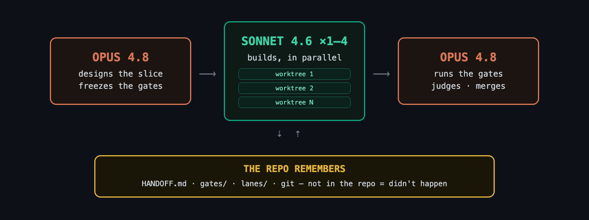
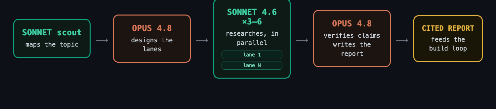

# architect-loop — space-centric

**Opus 4.8 handles planning and review; Sonnet 4.6 handles implementation and
research — both in Claude Code.** Two Claude Code skills wire that split into a
**space-centric** loop that spans one or more repos: the contract and its
acceptance rubric are written first, the builder works in fresh contexts per
repo, and the architect reviews the evidence before anything is integrated. It
runs on the Claude plan you already have — no second CLI, no extra API keys.

The space is the memory. Each slice is **one self-contained file**,
`artifacts/<NN>-<slice>.md`, grown section by section — **Grounds** (why),
**Contract** (what/how), **Rubric** (proof), **Builder Prompt** (dispatch
record), **Builder Report** (evidence), **Verdict** (judgment) — one commit per
section, so git history gives the differentiation and the change guarantees.
`artifacts/HANDOFF.md` indexes the slices; scratch (`tmp/architect/`) is
gitignored. The `space architect` command family manages initialization, slice
scaffolding, the rubric freeze, per-lane worktrees, and post-flight
verification. The mission spans the repos under `repos/`.

## Install (30 seconds)

```bash
git clone https://github.com/jetpks/architect-loop-multi-provider
cd architect-loop-multi-provider/opus-48-sonnet-46-space && ./install.sh   # Windows: .\install.ps1
```

Both roles are the same `claude` binary: the architect is your interactive
session, the builder is headless `claude -p` one tier down (Sonnet 4.6).
Nothing else to install. `./install.sh --project` installs to the current repo
only instead of globally. You need [Claude Code](https://claude.com/claude-code)
on any paid plan — that's it; the builder's `claude -p` hours draw on the Agent
SDK credit pool on the same plan.

## Space setup

Create a space and initialize the architect mission:

```bash
space new "Mission Name" org/repo1 org/repo2   # repos are variadic positionals (REPO...)
cd <space>
space architect init       # scaffolds artifacts/HANDOFF.md; adds `architect:` block to .space.yml; commits
space architect new my-slice  # scaffolds artifacts/01-my-slice.md (the six-section skeleton)
space architect status     # read-only: slices, freeze_shas, lanes, verdicts
```

The `space architect` command family (resolves the space from `$PWD`):

| Command | What it does |
|---|---|
| `space architect init [SPACE]` | Scaffold `artifacts/HANDOFF.md` + add `architect:` to `.space.yml`; commits |
| `space architect new SLICE [SPACE]` | Allocate the next ordinal; scaffold `artifacts/<NN>-<SLICE>.md`; record the slice; commits |
| `space architect status [SPACE]` | Read-only mission state (slices, freeze_shas, lanes, verdicts) |
| `space architect freeze SLICE [SPACE]` | Commit the slice file (must carry a `## Rubric`); record `freeze_sha`; refuses to re-freeze once a frozen section changed |
| `space architect worktree add REPO SLICE LANE [--base REF]` | Create `tmp/architect/wt/<SLICE>-<LANE>` off a repo's base commit; record in `.space.yml` |
| `space architect worktree remove SLICE LANE` | Remove the lane worktree |
| `space architect worktree list` | List active lane worktrees |
| `space architect verify SLICE [SPACE]` | REPORT per lane: frozen sections untouched, no builder commits, scratch report present, in-bounds |

## Use (two commands)

```
/architect                                      # the build loop
/architect-research <what you're considering>   # the research loop
```

`/architect` runs one work block: judge the last run, spec the next slice,
dispatch builders. `/architect-research` is for when you're still deciding
*what* to build — its cited report feeds the build loop's Grounds section.

## /architect



One short architect (Opus 4.8) session per work block — judgment only, it never
writes code:

- **Contract + rubric first.** The architect scaffolds a one-PR slice with
  `space architect new`, writes its **Contract** and acceptance **Rubric**,
  splits it into 1–4 lanes whose file sets are checked for overlap, and freezes
  via `space architect freeze SLICE` (the commit that adds the Rubric) *before*
  any builder starts. The builder never writes the slice file — so the Rubric is
  never in its editable blast radius — and any post-freeze change to a frozen
  section fails the slice automatically.
- **Parallel isolated builders.** One fresh `claude -p` (Sonnet 4.6, high
  thinking budget) per lane, each in its own worktree under `tmp/architect/wt/`
  created by `space architect worktree add`. Builders must argue with the spec
  before building (silent compliance = defect), build only their declared files,
  and write raw results to a scratch report — they never commit, and the
  architect verifies that post-flight (Claude Code has no sandbox, so the
  no-commit rule is enforced by git-write deny rules plus a `git log` check, not
  the runtime).
- **The architect judges and integrates.** It transcribes each scratch report
  verbatim into the slice's Builder Report, runs the gate commands itself
  (builder claims are hearsay), reads the diff against the Contract's intent
  (passing tests ≠ mergeable work), then commits and merges passing lanes.
  `space architect verify SLICE` reports per-lane status; judgment happens in a
  fresh session because the cited evidence favors fresh-context review.
- **The space is the memory.** Per-slice files `artifacts/<NN>-<slice>.md`,
  indexed by `artifacts/HANDOFF.md` (a short table of contents, pruned every
  session), plus space git history. Not in the committed artifacts = didn't
  happen. Scratch lives in `tmp/architect/` (gitignored by the space).
- **Supervision built in.** Liveness checks on dispatched runs, stall triage
  (diagnose the child process tree, kill the narrowest thing), explicit
  timeouts on every long command.

## /architect-research



Scout-first, like the production deep-research systems — no fixed lane
taxonomy:

- **A cheap `claude -p` scout maps the topic** (~10 searches): canonical
  terminology, the load-bearing systems and papers, the named people, the
  topic's natural fault lines. Skipped for comparisons and fact-finds.
- **The architect designs 3–6 topic-specific lanes** from the scout's map,
  drawing per-source-class tactics from a library (academic citation
  snowballing, dependents-not-stars repo evidence, emerging-vs-hype gating,
  production pattern mining, expert tracking) — checked for overlap and gaps
  before dispatch.
- **Parallel `claude -p` researchers** run under hard budgets: search caps, ≤5
  subjects per lane, saturation stop, strict findings discipline (URL + date
  + quote + confidence tag; NOT FOUND beats inference; no recommendations).
  Expert opinion runs as a second wave, roster-seeded by the first.
- **The architect verifies and writes.** ≥2 independent sources per
  load-bearing claim, adversarial falsification searches, citations only from
  URLs actually fetched — then one author writes one decision-oriented report.
  Gathering parallelizes; synthesis never does.

## Why this shape

Each design choice is source-backed (full citations in
[DESIGN.md](DESIGN.md)):

- Weak planners hurt more than weak executors — so the architect model does
  the design, and builders get explicit specs.
- Manager + worktree-isolated workers is a well-supported topology for
  shared-artifact software work; naive shared-file coordination collapses
  throughput.
- Frozen external gates beat trusting the agent — but agents game visible
  tests and their passing PRs are frequently unmergeable, so the architect
  also reads the diff.
- Memory files rot — so the handoff stays a short map, and detail lives in the
  per-slice `artifacts/<NN>-<slice>.md` files it links.
- The space model separates committed memory (artifacts/) from scratch
  (tmp/architect/) at the filesystem level — space-cadet gitignores `repos/`
  and `tmp/` so the invariant requires zero extra config.
- The surveyed production deep-research systems use planner-designed
  decomposition rather than fixed lanes — so research lanes are designed per
  topic, after a scout pass.

## What's in the box

| File | What it is |
|---|---|
| [DESIGN.md](DESIGN.md) | The design document — 12 enforced rules, failure-mode table, cited sources |
| [skills/architect/SKILL.md](skills/architect/SKILL.md) | The architect role: hard rules + procedure |
| [skills/architect/dispatch.md](skills/architect/dispatch.md) | Verified `claude -p` commands, lane-prompt template, worktree fan-out, stall triage |
| [skills/architect/research.md](skills/architect/research.md) | Slice-scale inline fact-check fan-out |
| [skills/architect/HANDOFF.template.md](skills/architect/HANDOFF.template.md) | The cross-slice table-of-contents template |
| [skills/architect/SLICE.template.md](skills/architect/SLICE.template.md) | The per-slice file skeleton (the six sections) |
| [skills/architect-research/SKILL.md](skills/architect-research/SKILL.md) | Research orchestration: scout → design → fan out → verify → write |
| [skills/architect-research/lanes.md](skills/architect-research/lanes.md) | Scout block + source-class tactics library with verified endpoints |
| [tests/validate_skills.py](tests/validate_skills.py) | Repo sanity checks (frontmatter limits, links, fences) |

## FAQ

**Do I need a second CLI or API keys?** No — both the architect and the builder
are Claude Code on your Claude plan. The builder's headless `claude -p` hours
draw on the Agent SDK credit pool (separate from interactive usage).

**What does a run cost?** Builder/researcher runs are headless `claude -p` on
the Agent SDK credit pool; a multi-hour parallel fan-out spends that pool but
won't hit a per-window quota that dies mid-run. The architect's Opus 4.8
sessions are minutes, not hours.

**What if a builder wrecks things?** Nothing reaches a branch until the
architect's tamper, boundary, and gate checks pass — including a `git log` check
that the lane made no commits (Claude Code has no sandbox, so git-write deny
rules plus that check stand in for it). Worktrees are discarded and
re-dispatched from the lane's repo base commit.

**Can I watch a run?** Yes — every dispatch prints the lane-prompt, so you
can paste it into an interactive `claude` session instead.

**Why two skills?** Research-grade fan-out costs ~15× chat-level tokens — it
should be a deliberate act, not a side-effect of the build loop.

**How is this different from `opus-48-sonnet-46`?** The models and builder CLI
are identical. The memory model differs: the earlier variant stores mission docs
in a single repo's `docs/` directory and scratch in a repo-local hidden
directory. This variant stores mission memory in a space-cadet space's
`artifacts/` (multi-repo, committed) and scratch in `tmp/architect/`
(gitignored). The `space architect` commands replace the manual git/path
mechanics.

## Origin

The original idea came from [this X post by @jumperz](https://x.com/jumperz/status/2065454404623384859)
about using Fable with Codex subagents. I built architect-loop because I couldn't
find an easy way to run that pattern, and because it seemed useful to add a few
extra operational best practices on top of what Fable can already do when calling
Codex subagents.

## License

MIT
